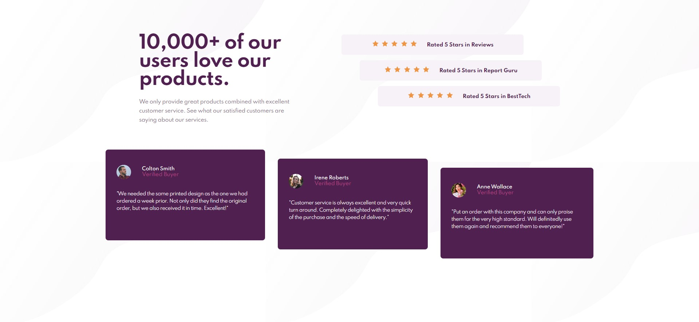
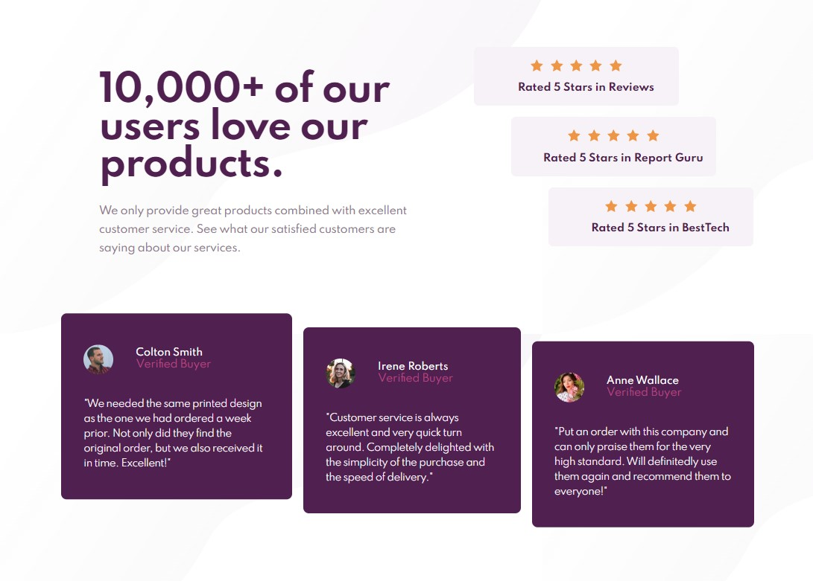
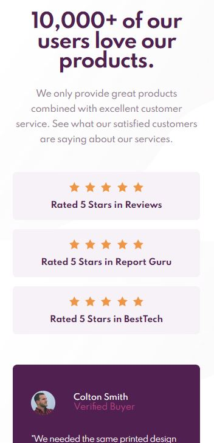

# Frontend Mentor - Social proof section solution

This is a solution to the [Social proof section challenge on Frontend Mentor](https://www.frontendmentor.io/challenges/social-proof-section-6e0qTv_bA).

## Table of contents

- [Screenshot](#screenshot)
- [My process](#my-process)
  - [Built with](#built-with)
  - [What I learned](#what-i-learned)

## Screenshot

Desktop

Tablet

Mobile

## Solution URL

https://a-stepanian.github.io/Social-proof-section/

## My process

### Built with

- Semantic HTML5 markup
- CSS custom properties
- Flexbox

### What I learned

- Blockquote is a good option to use for customer testimonials.  Aside works well for reviews.
- Sometimes it makes sense to provide separate styling for a medium sized screen, as shown here.